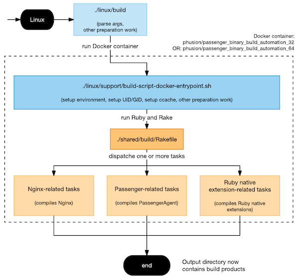
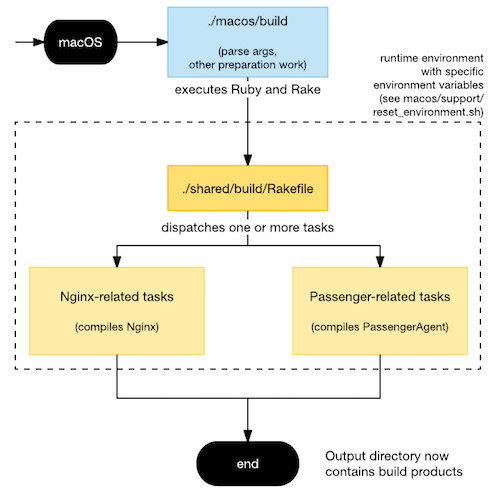

# How it works

**Table of contents**

 * [The build environment](#the-build-environment)
 * [The building process](#the-building-process)
 * [Version lockdown mechanism in Passenger (vendoring)](#version-lockdown-mechanism-in-passenger-vendoring)

## The build environment

`passenger_binary_build_automation` works by building Passenger and Nginx inside (semi-)controlled build environments.

### Linux: a Docker container

On Linux, the build environment is a Docker container. The container is based on [Holy Build Box](http://phusion.github.io/holy-build-box/) and contains an old glibc as well as a bunch of static libraries. Because Docker fully isolates a container from its host, this build environment is fully controlled: a build always succeeds no matter how the host is set up.

### macOS: a directory and bunch of env vars

On macOS, the build environment consists of a directory containing select tools and static libraries (the runtime), plus bunch of environment variables that try to make sure the compiler only compiles against our selected static libraries. This is a semi-controlled build environment: building *usually* works, but *may* fail if the host is set up in such a way that it interferes with the build. However we've found in practice that it's good enough.

The runtime directory may be located at any arbitrary location on the filesystem. Its path is passed to the invocation of various scripts such `macos/setup-runtime` and `macos/build`. So during local development, the path is entirely chosen by the developer. During the Passenger release process CI job, the runtime is located on the macOS CI server, at `/data/jenkins/cache/Passenger-Release-Process/generic-macos-binaries/{passenger,passenger-enterprise}/runtime`.

## The building process

The following diagrams describe how the raw building process looks like. Note that this is not the full process invoked from Phusion's Jenkins continuous integration server. Rather, it this process is invoked from the Jenkins script, which does more stuff than this.

The raw Linux building process:

The raw macOS building process:

## Version lockdown mechanism in Passenger (vendoring)

The Passenger Git repository locks down to a specific version of `passenger_binary_build_automation` using the Git submodule system. Not every `passenger_binary_build_automation` version is able to build every Passenger version, so we have this lockdown mechanism in place in order to guarantee compatibility.

The submodule inside Passenger is located in `packaging/binaries`. Whenever the Phusion Jenkins CI server performs any action using `passenger_binary_build_automation`, it is performed through this submodule.
